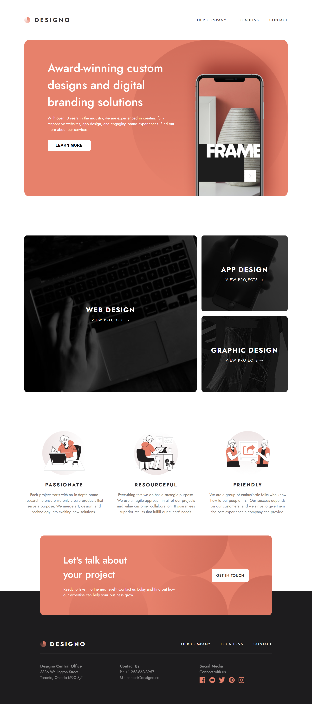
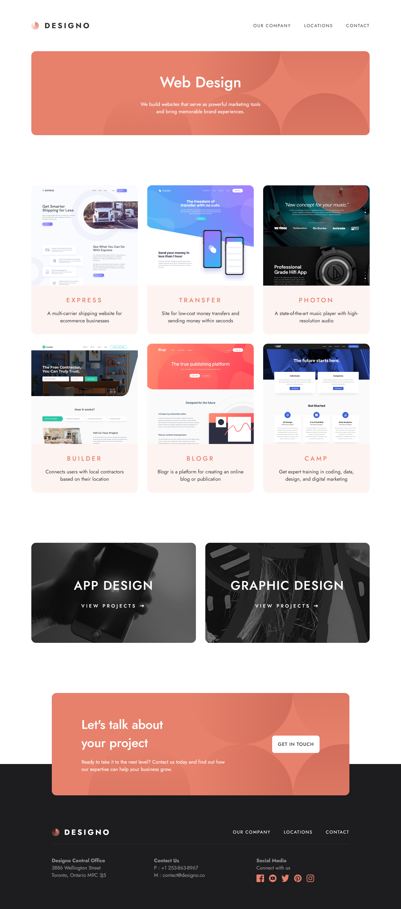

## Designo – Multi-Page Website

A fully responsive, multi-page website built using HTML, CSS, and JavaScript.This project includes modern layouts, reusable components, interactive elements, and mobile-first design.

### 🚀 Features : 

1. Multi-page layout (Home, About, Services, Contact, etc.)

2. Fully responsive design for mobile, tablet & desktop

3. Clean and modern UI

4. Reusable components (navigation, footer, cards)

5. Smooth animations & transitions

6. Custom JavaScript for menu toggle and interactions

7. Organized folder structure

### 🛠️ Technologies Used : 

1. HTML5 – Structure and content

2. CSS3 – Styling, flexbox, grid, animations

3. JavaScript

### 📸 Screenshots : 

  
  

  

